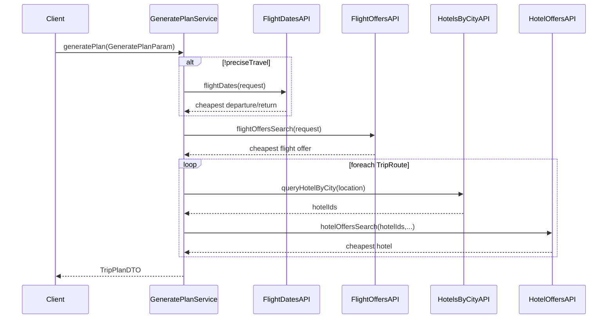

# Generate Trip Plan – Backend Design Document

## 1. 背景（Background）

一款智能旅行助手应用允许用户输入偏好与需求，或通过与 AI 助手对话来确认旅行目的地。系统需要基于收集的信息为用户生成完整的旅行计划（Trip Plan）。

## 2. 需求范围（Scope）

当前阶段只关注 **Backend** 端的接口和逻辑开发：

* 入口接口：`com.pkfare.trip.scale.plan.service.GeneratePlanService#generatePlan`
* 入参对象：`com.pkfare.trip.scale.plan.service.param.GeneratePlanParam`
* 目标：根据用户请求参数，自动完成机票 + 酒店搜索，生成一份可行的旅行方案。

## 3. 请求参数（Request Payload）
```json
{
  "origin": "Shenzhen",
  "location_code": "CN",
  "start_period": "2025-10-01",
  "end_period": "2025-10-14",
  "trip_days": 14,
  "adult_number": 1,
  "child_number": 1,
  "budgets": "15000",
  "currency": "CNY",
  "room_quantity": 2,
  "trip_routes": [
    {
      "stay_days": 4,
      "destination_city": "Rome",
      "country_code": "IT",
      "location_code": "FCO",
      "reason_for_recommendation": "As the heart of the Roman Empire and home to the Vatican, Rome is an unmissable destination for anyone who loves ancient buildings, history, and religious stories."
    },
    {
      "stay_days": 5,
      "destination_city": "Ostia",
      "country_code": "IT",
      "location_code": "OST",
      "reason_for_recommendation": "Known for Ostia Antica’s well-preserved Roman ruins, ancient streets, and theaters, Ostia offers a fascinating glimpse of everyday life in the Roman Empire."
    },
    {
      "stay_days": 5,
      "destination_city": "Anzio",
      "country_code": "IT",
      "location_code": "ANZ",
      "reason_for_recommendation": "A seaside town famous for beaches and World War II history, Anzio blends sun, history, and Italian coastal culture within an hour’s trip from Rome."
    }
  ]
}
```
> 对应 Java 类：`GeneratePlanParam` + 内部类/枚举 `TripRouteParam`。

### 字段说明

| 字段 | 说明 |
| ---- | ---- |
| origin | 出发城市 IATA 码或城市名（例：Shenzhen） |
| location_code | 出发国家/地区码（例：CN） |
| start_period / end_period | 可接受的出行时间范围 |
| trip_days | 行程天数（含出发与回程） |
| adult_number / child_number | 成人与儿童人数 |
| budgets / currency | 旅行预算及币种 |
| room_quantity | 酒店房间数量 |
| trip_routes | 行程拆分（多目的地） |

## 4. 业务流程（Business Flow）

整体流程分为 **航班查询** 与 **酒店查询** 两大阶段：

### 4.1 航班查询（Round-Trip Flights）

1. **计算精确行程标识 `preciseTravel`**
   * `preciseTravel = (end_period - start_period) == trip_days`，若完全匹配则为 `true`，否则 `false`。
2. **若 `preciseTravel == false`**
   * 调用 `AmadeusFlightDatesAPI#flightDates`（类：`com.pkfare.trip.scale.api.amadeus.flightdates.AmadeusFlightDatesAPI`）。
   * 请求参数：
     * `origin` ← `GeneratePlanParam.origin`
     * `destination` ← 第一段 `TripRoute.location_code`
     * `departureDate` ← `start_period,end_period-trip_days`（逗号拼接）
     * `duration` ← `trip_days`
     * `oneWay` ← `false`
   * **筛选逻辑**：在返回航班中找出去程与返程间隔正好为 `trip_days` 且总价最低的一组，得到 `departureDate` / `returnDate`。
3. **查询航班报价 `flightOffersSearch`**
   * 调用 `AmadeusFlightOffersSearchAPI#flightOffersSearch`。
   * 请求参数：
     | 字段 | 值 |
     | ---- | -- |
     | origin | `GeneratePlanParam.origin` |
     | destination | 第一段 `TripRoute.location_code` |
     | departureDate | 若 `preciseTravel==true` → `start_period` 否则取步骤 2 的 `departureDate` |
     | returnDate | 若 `preciseTravel==true` → `end_period` 否则取步骤 2 的 `returnDate` |
     | adults | `adult_number` |
     | children | `child_number` |
     | infants | `0` |
     | nonStop | `true` |
     | currency | `currency` |
     | maxPrice | `budgets / 2` |
     | max | `50` |
   * **筛选**：
     * 首选总价最低。
     * 对去程倾向选择早晨航班；返程尽量选择晚上航班。

### 4.2 酒店查询（Hotels）

1. **根据目的地城市拉取酒店列表**
   * 遍历 `trip_routes`，调用 `AmadeusSearchHotelsByCityAPI#queryHotelByCity`。
   * 请求参数：
     * `cityCode` ← `TripRoute.location_code`
     * `radius` ← `20`
     * `radiusUnit` ← `KM`
   * 返回值：`hotelId` 列表；将其按 `location_code` 聚合为 `localHotelIdMap<code, List<hotelId>>`。
2. **逐段查询最优报价**
   * 对每个 `TripRoute` 调用 `AmadeusHotelOffersSearchAPI#hotelOffersSearch`，找出该段最便宜酒店。
   * 请求参数：
     | 字段 | 值 |
     | ---- | -- |
     | hotelIds | `localHotelIdMap.get(location_code)` |
     | checkInDate | 第一段：去程到达时间；后续段：上一个段落的 `checkOutDate` |
     | checkOutDate | `checkInDate + stay_days` |
     | adults | `adult_number + child_number` |
     | countryOfResidence | `TripRoute.country_code` |
     | roomQuantity | `room_quantity` |
     | priceRange | `"10,5000"` |
     | currency | `currency` |

## 5. 关键类与方法（Key Classes / Methods）

| 组件 | 说明 |
| ---- | ---- |
| `GeneratePlanService#generatePlan` | 入口服务，串联整体流程；返回最终 `TripPlanDTO`（待实现）。 |
| `AmadeusFlightDatesAPI` | 查询往返日期价格区间 |
| `AmadeusFlightOffersSearchAPI` | 查询具体航班报价 |
| `AmadeusSearchHotelsByCityAPI` | 根据城市查酒店基本信息 |
| `AmadeusHotelOffersSearchAPI` | 查询酒店报价 |
| `GeneratePlanParam` / `TripRouteParam` | 请求数据载体 |

## 6. 数据流程图（Sequence Diagram）



## 7. 失败与异常处理（Error Handling）

1. **外部 API 超时 / 4xx / 5xx**
   * 捕获 `AmadeusApiException`，重试 3 次；仍失败则返回用户友好错误码 `TRIP_API_ERROR`。
2. **预算不足**
   * 若最优航班 + 酒店花费 > `budgets`，标记 `PlanStatus=OVER_BUDGET` 并提示用户调整预算或行程。
3. **数据缺失**
   * 任意 API 无可用结果时，返回 `PlanStatus=NO_AVAILABLE_OPTION`。

## 8. 配置与扩展（Config & Extensibility）

* **Amadeus API** 认证：`src/main/java/com/pkfare/trip/scale/api/amadeus/config/*`。
* 后续可接入 Skyscanner、Booking.com 等供应商；只需实现相同接口并在 `GeneratePlanService` 注入策略。

## 9. 测试策略（Testing）

* 单元测试：`Amadeus*APITest.java` 覆盖查询逻辑。
* 集成测试：Mock Amadeus API，通过 `GeneratePlanService` 演练完整流程。

## 10. TODO

- [ ] 定义 `TripPlanDTO`、`FlightInfoDTO`、`HotelInfoDTO` 等输出模型。
- [ ] `GeneratePlanService` 实现航班 + 酒店拼接逻辑，保证日期连续且城市顺序正确。
- [ ] 完成异常码规范及国际化文案。
- [ ] 补充全量测试用例。