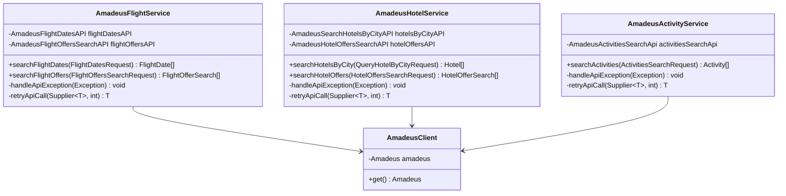
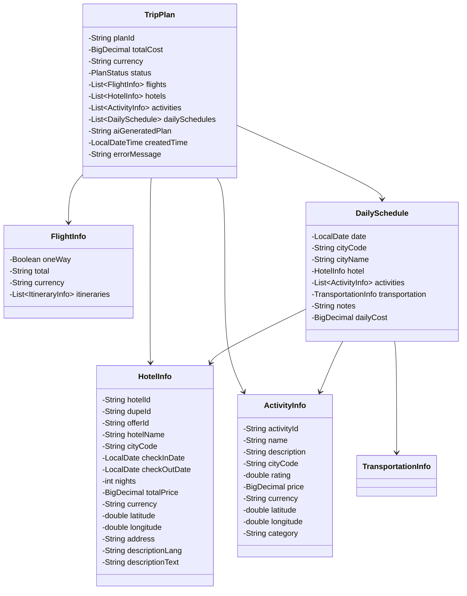

# Trip Plan Generator - 工程代码架构设计

## 1. 整体工程包结构划分

基于现有的 `trip-scale-lite` 项目结构，以下是完整的包结构设计：

```
com.pkfare.trip.scale/
├── controller/                     # 控制层
│   └── TripPlanController.java
├── service/                        # 业务服务层
│   ├── plan/
│   │   ├── GeneratePlanService.java
│   │   ├── FlightSearchService.java
│   │   ├── HotelSearchService.java
│   │   ├── ActivitySearchService.java
│   │   └── PlanAggregationService.java
│   └── external/                   # 外部服务集成
│       ├── amadeus/
│       │   ├── AmadeusFlightService.java
│       │   ├── AmadeusHotelService.java
│       │   └── AmadeusActivityService.java
│       └── ai/
│           └── GeminiPlanningService.java
├── model/                          # 数据模型层
│   ├── request/                    # 请求模型
│   │   ├── GeneratePlanParam.java
│   │   └── TripRouteParam.java
│   ├── response/                   # 响应模型
│   │   ├── TripPlan.java
│   │   ├── FlightInfo.java
│   │   ├── HotelInfo.java
│   │   ├── ActivityInfo.java
│   │   ├── DailySchedule.java
│   │   └── TransportationInfo.java
│   ├── dto/                        # 数据传输对象
│   │   ├── FlightSearchResult.java
│   │   ├── HotelSearchResult.java
│   │   ├── ActivitySearchResult.java
│   │   └── SubmitAiPlanInfo.java
│   └── enums/                      # 枚举类
│       ├── PlanStatus.java
│       └── TransportationType.java
├── api/                            # 外部API集成层
│   └── amadeus/                    # Amadeus API集成
│       ├── config/
│       ├── flightdates/
│       ├── flightoffers/
│       ├── hotelbycity/
│       ├── hoteloffers/
│       ├── activities/
│       └── exception/
├── agent/                          # AI Agent层
│   ├── planning/
│   │   ├── PlanningAgent.java
│   │   └── PlanningPrompt.java
│   └── inspiration/
├── util/                           # 工具类
│   ├── DateUtil.java
│   ├── PriceUtil.java
│   ├── LocationUtil.java
│   └── ValidationUtil.java
├── config/                         # 配置类
│   ├── ApplicationConfig.java
│   └── GoogleConfig.java
└── exception/                      # 异常处理
    ├── TripPlanException.java
    ├── ExternalApiException.java
    └── GlobalExceptionHandler.java
```

## 2. 核心类图设计

### 2.1 服务层类图

```mermaid
classDiagram
    class GeneratePlanService {
        -FlightSearchService flightSearchService
        -HotelSearchService hotelSearchService
        -ActivitySearchService activitySearchService
        -GeminiPlanningService geminiPlanningService
        -PlanAggregationService planAggregationService
        +generatePlan(GeneratePlanParam) TripPlan
        -validateParams(GeneratePlanParam) void
        -calculatePreciseTravel(GeneratePlanParam) boolean
        -calculateRoundTrip(GeneratePlanParam) boolean
    }
    
    class FlightSearchService {
        -AmadeusFlightService amadeusFlightService
        +searchFlights(GeneratePlanParam, boolean, boolean) List~FlightInfo~
        -searchFlightDates(GeneratePlanParam, boolean) FlightDateResult
        -searchFlightOffers(GeneratePlanParam, FlightDateResult) List~FlightInfo~
        -filterBestFlights(List~FlightOfferSearch~) List~FlightInfo~
    }
    
    class HotelSearchService {
        -AmadeusHotelService amadeusHotelService
        +searchHotels(GeneratePlanParam, List~FlightInfo~) List~HotelInfo~
        -getHotelsByCity(List~TripRouteParam~) Map~String, List~String~~
        -searchHotelOffers(TripRouteParam, List~String~, LocalDate, LocalDate) List~HotelInfo~
        -filterCheapestHotels(List~HotelOfferSearch~) List~HotelInfo~
    }
    
    class ActivitySearchService {
        -AmadeusActivityService amadeusActivityService
        +searchActivities(List~HotelInfo~) List~ActivityInfo~
        -filterTopActivities(List~Activity~) List~ActivityInfo~
    }
    
    class GeminiPlanningService {
        -PlanningAgent planningAgent
        +generateAiPlan(SubmitAiPlanInfo) String
        -buildPrompt(SubmitAiPlanInfo) String
        -parseAiResponse(String) String
    }
    
    class PlanAggregationService {
        +aggregateTripPlan(GeneratePlanParam, List~FlightInfo~, List~HotelInfo~, List~ActivityInfo~, String) TripPlan
        -calculateTotalCost(List~FlightInfo~, List~HotelInfo~, List~ActivityInfo~) BigDecimal
        -buildDailySchedules(GeneratePlanParam, List~HotelInfo~, List~ActivityInfo~) List~DailySchedule~
        -determinePlanStatus(BigDecimal, String) PlanStatus
    }
    
    GeneratePlanService --> FlightSearchService
    GeneratePlanService --> HotelSearchService
    GeneratePlanService --> ActivitySearchService
    GeneratePlanService --> GeminiPlanningService
    GeneratePlanService --> PlanAggregationService
```



### 2.2 外部服务集成类图



### 2.3 数据模型类图



## 3. 核心类详细设计

### 3.1 GeneratePlanService（主服务类）

**职责：** 旅行计划生成的主要业务逻辑协调器，负责整个流程的编排和控制。

**主要方法：**

```java
public class GeneratePlanService {
    
    /**
     * 生成旅行计划主入口
     * @param param 生成计划参数
     * @return 完整的旅行计划
     */
    public TripPlan generatePlan(GeneratePlanParam param) {
        // 1. 参数验证
        // 2. 计算 preciseTravel 和 roundTrip
        // 3. 搜索航班
        // 4. 搜索酒店
        // 5. 搜索活动
        // 6. AI 生成计划
        // 7. 聚合结果
    }
    
    /**
     * 验证输入参数
     */
    private void validateParams(GeneratePlanParam param) throws TripPlanException;
    
    /**
     * 计算是否为精确旅行时间
     */
    private boolean calculatePreciseTravel(GeneratePlanParam param);
    
    /**
     * 计算是否为往返行程
     */
    private boolean calculateRoundTrip(GeneratePlanParam param);
}
```

**与其他类的交互关系：**
- 依赖 `FlightSearchService` 进行航班搜索
- 依赖 `HotelSearchService` 进行酒店搜索
- 依赖 `ActivitySearchService` 进行活动搜索
- 依赖 `GeminiPlanningService` 进行 AI 计划生成
- 依赖 `PlanAggregationService` 进行结果聚合

### 3.2 FlightSearchService（航班搜索服务）

**职责：** 负责航班搜索的业务逻辑，包括日期搜索和具体航班搜索。

**主要方法：**

```java
public class FlightSearchService {
    
    /**
     * 搜索航班
     * @param param 搜索参数
     * @param preciseTravel 是否精确时间
     * @param roundTrip 是否往返
     * @return 航班信息列表
     */
    public List<FlightInfo> searchFlights(GeneratePlanParam param, boolean preciseTravel, boolean roundTrip);
    
    /**
     * 搜索最便宜的航班日期
     */
    private FlightDateResult searchFlightDates(GeneratePlanParam param, boolean roundTrip);
    
    /**
     * 搜索具体航班报价
     */
    private List<FlightInfo> searchFlightOffers(GeneratePlanParam param, FlightDateResult dateResult);
    
    /**
     * 筛选最佳航班
     */
    private List<FlightInfo> filterBestFlights(List<FlightOfferSearch> offers);
}
```

### 3.3 HotelSearchService（酒店搜索服务）

**职责：** 负责酒店搜索的业务逻辑，包括按城市搜索酒店和具体报价搜索。

**主要方法：**

```java
public class HotelSearchService {
    
    /**
     * 搜索酒店
     * @param param 搜索参数
     * @param flights 航班信息（用于确定入住时间）
     * @return 酒店信息列表
     */
    public List<HotelInfo> searchHotels(GeneratePlanParam param, List<FlightInfo> flights);
    
    /**
     * 根据城市获取酒店ID列表
     */
    private Map<String, List<String>> getHotelsByCity(List<TripRouteParam> routes);
    
    /**
     * 搜索酒店报价
     */
    private List<HotelInfo> searchHotelOffers(TripRouteParam route, List<String> hotelIds, 
                                             LocalDate checkIn, LocalDate checkOut);
}
```

### 3.4 ActivitySearchService（活动搜索服务）

**职责：** 负责景点活动搜索的业务逻辑。

**主要方法：**

```java
public class ActivitySearchService {
    
    /**
     * 搜索活动
     * @param hotels 酒店信息（用于获取经纬度）
     * @return 活动信息列表
     */
    public List<ActivityInfo> searchActivities(List<HotelInfo> hotels);
    
    /**
     * 筛选评分最高的活动
     */
    private List<ActivityInfo> filterTopActivities(List<Activity> activities);
}
```

### 3.5 GeminiPlanningService（AI 计划生成服务）

**职责：** 负责调用 Gemini AI 生成详细的旅行计划。

**主要方法：**

```java
public class GeminiPlanningService {
    
    /**
     * 生成 AI 计划
     * @param planInfo 计划信息
     * @return AI 生成的计划文本
     */
    public String generateAiPlan(SubmitAiPlanInfo planInfo);
    
    /**
     * 构建提示词
     */
    private String buildPrompt(SubmitAiPlanInfo planInfo);
    
    /**
     * 解析 AI 响应
     */
    private String parseAiResponse(String response);
}
```

## 4. 接口与实现设计

### 4.1 外部服务接口定义

```java
// 航班搜索接口
public interface FlightSearchInterface {
    List<FlightInfo> searchFlights(GeneratePlanParam param, boolean preciseTravel, boolean roundTrip);
}

// 酒店搜索接口
public interface HotelSearchInterface {
    List<HotelInfo> searchHotels(GeneratePlanParam param, List<FlightInfo> flights);
}

// 活动搜索接口
public interface ActivitySearchInterface {
    List<ActivityInfo> searchActivities(List<HotelInfo> hotels);
}

// AI 计划生成接口
public interface PlanGenerationInterface {
    String generateAiPlan(SubmitAiPlanInfo planInfo);
}
```

### 4.2 实现思路

1. **服务层实现：** 每个服务类实现对应的接口，便于测试和扩展
2. **外部API适配：** 通过适配器模式封装 Amadeus API 调用
3. **异常处理：** 统一的异常处理机制，包括重试逻辑
4. **配置管理：** 通过配置类管理外部服务的配置信息

## 5. 关键数据模型字段设计

### 5.1 TripPlan（旅行计划）

| 字段 | 类型 | 用途 | 备注 |
|------|------|------|------|
| planId | String | 计划唯一标识 | UUID生成 |
| totalCost | BigDecimal | 总费用 | 包含航班、酒店、活动费用 |
| currency | String | 币种 | 如CNY、USD |
| status | PlanStatus | 计划状态 | SUCCESS/OVER_BUDGET/NO_AVAILABLE_OPTION等 |
| flights | List\<FlightInfo\> | 航班信息列表 | 包含去程和返程 |
| hotels | List\<HotelInfo\> | 酒店信息列表 | 按城市和日期排序 |
| activities | List\<ActivityInfo\> | 活动信息列表 | 按城市分组 |
| dailySchedules | List\<DailySchedule\> | 每日行程安排 | 详细的日程安排 |
| aiGeneratedPlan | String | AI生成的计划文本 | Gemini生成的详细计划 |
| createdTime | LocalDateTime | 创建时间 | 计划生成时间 |
| errorMessage | String | 错误信息 | 状态非SUCCESS时的错误描述 |

### 5.2 FlightInfo（航班信息）

| 字段 | 类型 | 用途 | 备注 |
|------|------|------|------|
| oneWay | Boolean | 是否单程 | true为单程，false为往返 |
| total | String | 航班总价 | 包含所有费用 |
| currency | String | 价格币种 | 如CNY、USD |
| itineraries | List\<ItineraryInfo\> | 行程集合 | 包含去程和返程行程 |

### 5.3 HotelInfo（酒店信息）

| 字段 | 类型 | 用途 | 备注 |
|------|------|------|------|
| hotelId | String | 酒店ID | Amadeus系统中的酒店标识 |
| dupeId | String | 重复ID | 用于去重 |
| offerId | String | 报价ID | 具体报价的标识 |
| hotelName | String | 酒店名称 | 酒店的显示名称 |
| cityCode | String | 城市代码 | IATA城市代码 |
| checkInDate | LocalDate | 入住日期 | 入住日期 |
| checkOutDate | LocalDate | 退房日期 | 退房日期 |
| nights | int | 住宿夜数 | 计算得出的住宿天数 |
| totalPrice | BigDecimal | 总价格 | 住宿总费用 |
| currency | String | 币种 | 价格币种 |
| latitude | double | 纬度 | 用于活动搜索 |
| longitude | double | 经度 | 用于活动搜索 |
| address | String | 地址 | 酒店地址 |
| descriptionLang | String | 描述语言 | 描述文本的语言 |
| descriptionText | String | 描述文案 | 酒店描述 |

### 5.4 ActivityInfo（活动信息）

| 字段 | 类型 | 用途 | 备注 |
|------|------|------|------|
| activityId | String | 活动ID | Amadeus系统中的活动标识 |
| name | String | 活动名称 | 活动的显示名称 |
| description | String | 活动描述 | 详细描述 |
| cityCode | String | 城市代码 | IATA城市代码 |
| rating | double | 评分 | 活动评分，用于排序 |
| price | BigDecimal | 价格 | 活动费用 |
| currency | String | 币种 | 价格币种 |
| latitude | double | 纬度 | 活动位置 |
| longitude | double | 经度 | 活动位置 |
| category | String | 活动类别 | 如景点、娱乐等 |

### 5.5 DailySchedule（每日行程）

| 字段 | 类型 | 用途 | 备注 |
|------|------|------|------|
| date | LocalDate | 日期 | 行程日期 |
| cityCode | String | 城市代码 | 当日所在城市 |
| cityName | String | 城市名称 | 城市显示名称 |
| hotel | HotelInfo | 当日酒店 | 住宿酒店信息 |
| activities | List\<ActivityInfo\> | 当日活动列表 | 安排的活动 |
| transportation | TransportationInfo | 交通信息 | 城市间移动信息 |
| notes | String | 备注信息 | 特殊说明 |
| dailyCost | BigDecimal | 当日费用 | 当日总花费 |

## 6. 异常处理设计

### 6.1 异常层次结构

```java
// 基础异常
public class TripPlanException extends RuntimeException {
    private String errorCode;
    private String errorMessage;
}

// 外部API异常
public class ExternalApiException extends TripPlanException {
    private int httpStatus;
    private String apiName;
}

// 参数验证异常
public class ParameterValidationException extends TripPlanException {
    private String fieldName;
    private Object fieldValue;
}

// 预算超支异常
public class BudgetExceededException extends TripPlanException {
    private BigDecimal actualCost;
    private BigDecimal budgetLimit;
}
```

### 6.2 全局异常处理器

```java
@ControllerAdvice
public class GlobalExceptionHandler {
    
    @ExceptionHandler(TripPlanException.class)
    public ResponseEntity<ErrorResponse> handleTripPlanException(TripPlanException e);
    
    @ExceptionHandler(ExternalApiException.class)
    public ResponseEntity<ErrorResponse> handleExternalApiException(ExternalApiException e);
    
    @ExceptionHandler(ParameterValidationException.class)
    public ResponseEntity<ErrorResponse> handleParameterValidationException(ParameterValidationException e);
}
```

## 7. 配置管理设计

### 7.1 应用配置

```java
@Configuration
@ConfigurationProperties(prefix = "trip.plan")
public class TripPlanConfig {
    private int maxRetryAttempts = 3;
    private long retryDelayMs = 1000;
    private int maxActivitiesPerCity = 5;
    private double activitySearchRadiusKm = 20.0;
    private BigDecimal defaultPriceRange = new BigDecimal("10,5000");
}
```

### 7.2 外部服务配置

```java
@Configuration
@ConfigurationProperties(prefix = "amadeus")
public class AmadeusConfig {
    private String clientId;
    private String clientSecret;
    private String baseUrl;
    private int timeoutMs = 30000;
    private int maxConnections = 100;
}
```

## 8. 测试策略

### 8.1 单元测试结构

```
src/test/java/com/pkfare/trip/scale/
├── service/
│   ├── GeneratePlanServiceTest.java
│   ├── FlightSearchServiceTest.java
│   ├── HotelSearchServiceTest.java
│   └── ActivitySearchServiceTest.java
├── external/
│   ├── AmadeusFlightServiceTest.java
│   ├── AmadeusHotelServiceTest.java
│   └── AmadeusActivityServiceTest.java
└── integration/
    └── TripPlanIntegrationTest.java
```

### 8.2 测试覆盖重点

1. **业务逻辑测试：** 各种参数组合下的业务流程
2. **异常处理测试：** 外部API异常、参数验证异常等
3. **边界条件测试：** 预算限制、日期边界等
4. **集成测试：** 完整流程的端到端测试

这个架构设计提供了清晰的分层结构、明确的职责划分和完整的数据模型，为团队开发提供了详细的指导方案。
